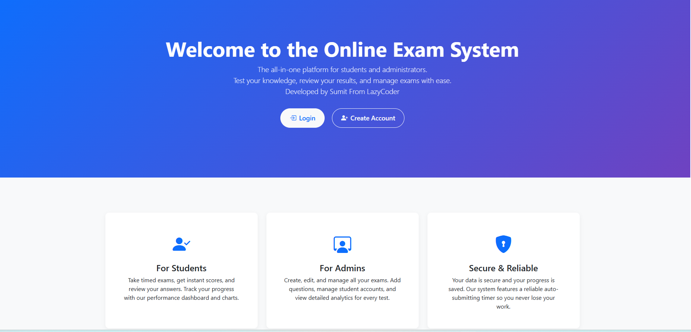
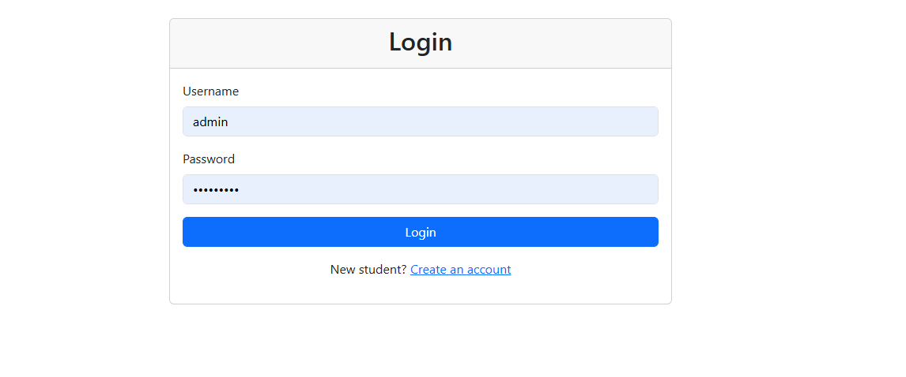
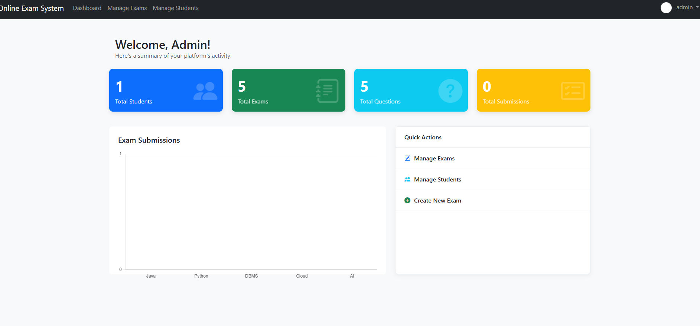
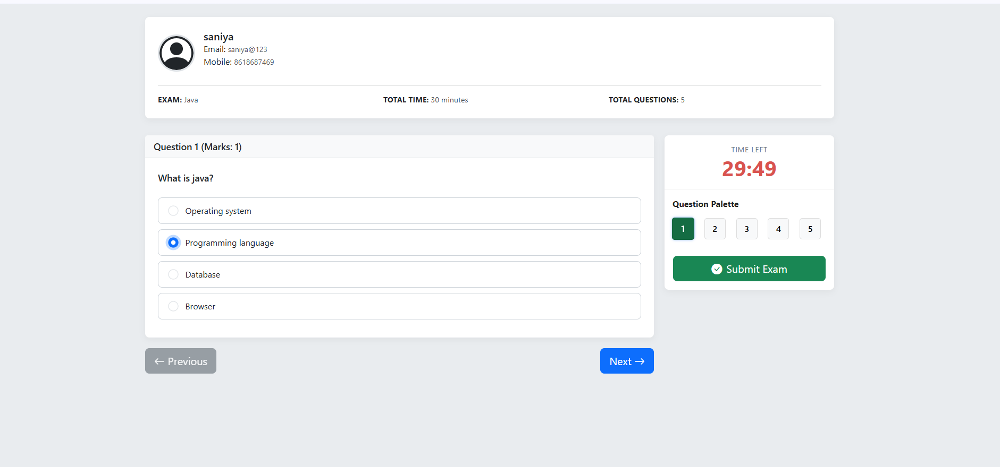
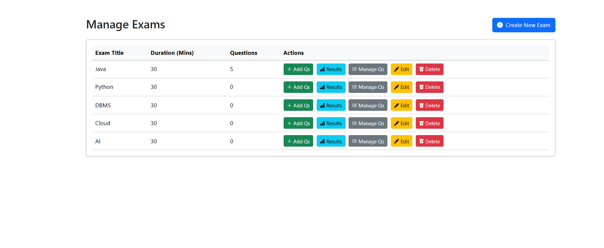
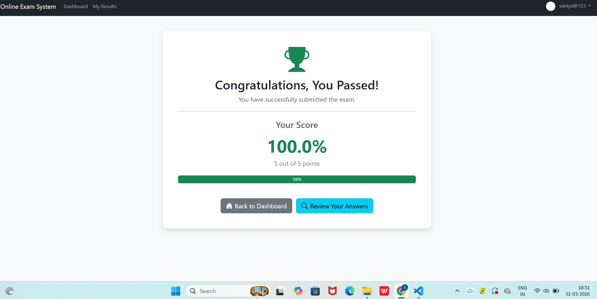

# 🚀 Online Exam System – Java (Spring Boot)

<p align="center">


</p>

A comprehensive **Online Examination System** built using **Spring Boot, Spring Security, Thymeleaf, Bootstrap 5**, and **JPA/Hibernate**.  
The platform provides a secure and user-friendly environment for **Admins** and **Students** to manage and take online tests effectively.


# ✨ Features

## 👨‍💻 Admin Features
- Secure Admin Login
- Stats Dashboard (Total Students, Exams, Questions, Submissions)
- **Exam CRUD** (title, duration, description)
- **Question CRUD** per exam
- Cascade deletes for exams → questions → results
- Protect answered questions from accidental delete
- Manage Students
- Reset Student Password
- Delete Student Account (cascade all related data)
- View all submissions for any exam

---

## 🧑‍🎓 Student Features
- Student Registration (Full Name, Email, Mobile, Profile Picture)
- Secure Login
- Dashboard with KPIs + Performance Chart
- Take Exam (paginated interface + question palette)
- Live Timer (auto submit)
- Instant Results (score, percentage, pass/fail)
- Detailed Review Page (correct vs incorrect answers)
- Profile Update
- Upload New Profile Picture
- Change Password
- View All Previous Exam Results

---

# 🛠️ Tech Stack

| Layer | Technology                                 |
|------|--------------------------------------------|
| Backend | Spring Boot 3, Spring Security 6           |
| Frontend | Thymeleaf, Html, Bootstrap 5, Chart.js     |
| Database | H2 (file-based) (configurable to other DB) |
| ORM | Hibernate / JPA                            |
| Build | Maven                                      |
| Storage | Local File System for images               |

---

# 🚀 How to Run the Project

### ✔️ Prerequisites
- Java **17+**
- Maven
- Any IDE (IntelliJ, VS Code, Eclipse)

---

### ✔️ Clone the Repository

```bash
git clone https://github.com/saniyamulla162005/Online-Exam-System.git
cd Online-Exam-System
```
---
### ✔️ Start the Application

Open the project → Run:

`OnlineExamApplication.java`

Server will start at:

👉 http://localhost:7890

---

# 🗄️ Database (H2)

Access H2 Console:

👉 http://localhost:7890/h2-console

```
JDBC URL : jdbc:h2:file:./data/examdb  
Username : sa
Password : password
```

---

# 🔐 Default Admin User

| Username | Password |
|---------|----------|
| admin | adminpass |

---


## 📸 Screenshots

### Login Page



### Login & Registration



### Admin Dashboard



### Exam Page



### Exam Manage 



### Result page 



# 👩‍💻 Author

**Saniya Mulla**

- BE Computer Science & Engineering Student
- Java & Spring Boot Developer
- Passionate about Backend Development and AI

# 📜 License

This project is **open-source** under the **MIT License**.

---


